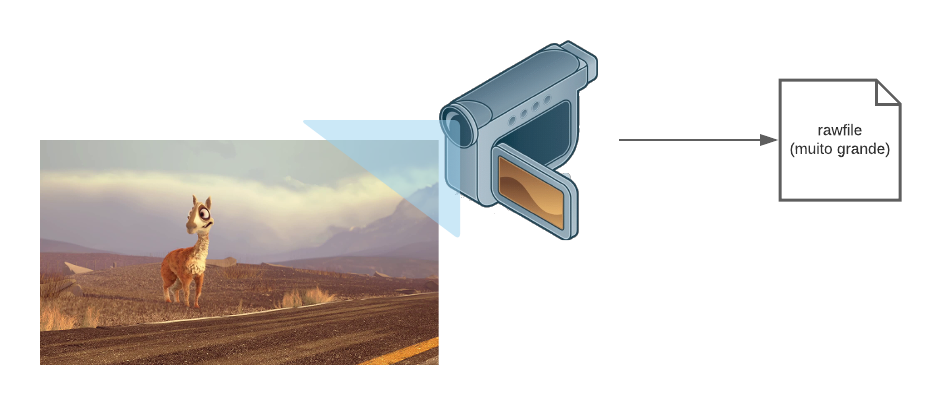

- [Meu primeiro stream](#meu-primeiro-stream)
  - [Ferramentas recomendadas](#ferramentas-recomendadas)
    - [Imagens docker necessárias](#imagens-docker-necessárias)
  - [Mãos a obra](#mãos-a-obra)
    - [Obtendo o vídeo base](#obtendo-o-vídeo-base)
    - [Importância do bitrate no streaming](#importância-do-bitrate-no-streaming)
    - [Adaptative bitrate para o resgate](#adaptative-bitrate-para-o-resgate)
      - [Gerando formatos de diversas qualidades a partir do vídeo base](#gerando-formatos-de-diversas-qualidades-a-partir-do-vídeo-base)
      - [Download Progressivo](#download-progressivo)
      - [Protocolos de streaming](#protocolos-de-streaming)
    - [Tocando o streaming](#tocando-o-streaming)

# Meu primeiro stream

Olá! Tudo bem? Espero que sim! :smiley:

O objetivo dessa página é guiar você para entender um pouco de como funciona
o mundo de entrega de vídeos.

O foco é te fazer entender o fluxo básico necessário para fazer um streaming
através da web.

## Ferramentas recomendadas

* [VLC](https://www.videolan.org/vlc/index.pt-BR.html), FFPlay ou outro tocador de vídeos
* [Docker](https://www.docker.com/get-started)
* Google Chrome/Firefox ou outro navegador web de sua preferência

### Imagens docker necessárias
Se você deseja seguir esse guia offline, baixe as imagens docker abaixo

```bash
docker pull jrottenberg/ffmpeg:4.3-alpine
docker pull webratio/nodejs-http-server:0.9.0
```

## Mãos a obra

### Obtendo o vídeo base
Antes de tudo, precisamos de um vídeo base para trabalhar.

Geralmente o vídeo original vem de uma captura de câmera, ou softwares de
edição ou renderização 3D. Ele é salvo em um formatos comumente chamados de
**RAW**, ou arquivo bruto, que contém informações muito importantes pra quem
vai editar e modificar, mas não interessam para o visualizador final na
maioria das vezes.



Nesse guia, iremos gerar um vídeo utilizando o **FFMPEG**, um software mais
conhecido por ser o canivete suíco para se trabalhar com vídeos. Dessa
maneira, você consegue seguir esse guia mesmo sem uma conexão com a internet.

Caso queira utilizar arquivos de vídeo "de verdade", a Blender Foundation tem
uma série de [vídeos abertos e gratuitos](https://www.blender.org/about/projects/) que possuem um licença que permite o uso livre deles. 

Para gerar um vídeo base utilizando o FFMPEG, basta executar o comando abaixo.

```bash
docker run --rm -v $(pwd):/files "jrottenberg/ffmpeg:4.3-alpine"\
  -hide_banner -y \
  -re -f lavfi -i "testsrc2=size=1280x720:rate=30,format=yuv420p" \
  -f lavfi -i "sine=frequency=1000:sample_rate=48000" \
  -c:v libx264 -preset ultrafast -tune zerolatency -profile:v high \
  -t 0:20 files/mps.mp4
```

<details>
  <summary> Explicação do comando </summary>

> * `-hide-banner`: Esconde o banner do ffmpeg 
> * `-re`: Lê a entrada obedecendo o framerate nativo
> * `-f lavfi`: Define o formato para _lavfi_ (libavfilter). Através dele podemos usar um input virtual
> * `-i "testsrc2=size=1280x720:rate=30,format=yuv420p"`: 
>   * `testsrc2=size=1280x720`: Gerar o input virtual do tipo `testsrc2` com a resolução 1280x720
>   * `rate=30`: Frames por segundo (FPS)
>   * `format=yuv420p`: Padrão de cores utilizado
> * `-i "sine=frequency=1000:sample_rate=48000"`:
>   * `sine=frequency=1000`: Define uma frequencia fixa de áudio no valor 1000
>   * `sample_rate=48000`: Define sample_rate de áudio para 48000
> * `-c:v libx264`: Usa o encoder libx264 (versão opensource do H.264)
> * `-preset ultrafast`: Utiliza um preset de configurações para realizar o encoding. 
> * `-tune zerolatency`: Realiza algumas modificações nas configurações de encoding
> * `-profile:v high`: Profile do H.264, valor utilizado por padrão para dispositivos modernos
> * `-t 0:20`: Duração do vídeo é igual a 20 segundos 
> * `files/mps.mp4`: Arquivo de saída
>
> Você pode ler mais sobre esses parâmetros na [documentação do FFMPEG](https://trac.ffmpeg.org/wiki/Encode/H.264)
</details></br>

Se o comando foi executado corretamente, o resultado deve ser algo parecido
com mostrado abaixo:


### Importância do bitrate no streaming

O **bitrate de um vídeo** é basicamente quantos bits existem por segundo de
vídeo exibido. A unidade de medida é bem parecida com a que vemos quando
realizamos um download de arquivo (`[GMK]b/s`), geralmente acaba-se omitido o
`/s`, ficando por exemplo `800k`.

Quanto maior o bitrate de um vídeo, mais dados são trafegados/lidos por segundo,
isso significa que quanto maior o bitrate, **geralmente**, maior a
qualidade. _Geralmente_ porque o fato de mais dados estarem sendo transmitidos
não significa necessariamente uma qualidade maior.

Para ilustrar quão importante são os bitrates para o streaming, imagine que você
quer assistir um vídeo cujo bitrate seja `3.5mbps`, mas sua capacidade de
banda de rede é apenas `1mbps`. Você vai precisar esperar **3 segundos e meio**
pra conseguir assistir a um segundo de vídeo. Imagine o tempo necessário para
assistir um vídeo que possui horas de duração, como um filme.

Uma maneira atual de contornar isso é gerar cópias do mesmo vídeo com
diferentes bitrates, e entregar o mais adequado para a rede do espectador.
Essa técnica é chamada de **adaptative bitrate** ou bitrate adaptativo.

### Adaptative bitrate para o resgate

É das mais importantes features suportadas pelos protocolos de streaming
hoje. Ela permite que o player consiga trocar entre diversas qualidades
disponíveis de acordo com a banda de rede disponível. Melhorando a qualidade
de experiência do usuário e o consumo de banda, entre outras coisas.

Para o _adaptative bitrate_ funcionar, é necessário que sejam geradas cópias
do vídeo inicial com bitrates adequados para a reprodução em diferentes
dispositivos e redes.

#### Gerando formatos de diversas qualidades a partir do vídeo base

Vamos gerar 4 vídeos com bitrates e resoluções diferentes, a partir do nosso
vídeo base. As informações estão na tabela abaixo:

| Resolução |Bitrate de áudio | Bitrate de Vídeo | Bitrate total |
|-----------|-----------------|------------------|---------------|
| 240p      | 96k             | 700k             | 796k          |
| 360p      | 96k             | 800k             | 896k          |
| 480p      | 128k            | 1400k            | 1528k         |
| 720p      | 128k            | 2800k            | 3928k         |

```bash
docker run --rm -v $(pwd):/files "jrottenberg/ffmpeg:4.3-alpine" \
  -hide_banner -y -i files/mps.mp4 \
	-s 1280x720 -c:a aac -b:a 128k -c:v libx264 -b:v 2800k files/mps_720.mp4 \
	-s 858x480  -c:a aac -b:a 128k -c:v libx264 -b:v 1400k files/mps_480.mp4 \
	-s 640x360  -c:a aac -b:a 96k  -c:v libx264 -b:v 800k  files/mps_360.mp4 \
	-s 352x240  -c:a aac -b:a 96k  -c:v libx264 -b:v 700k  files/mps_240.mp4
```

<details>
  <summary> Explicação do comando</summary>

> * `-i mps.mp4`: Arquivo de entrada
> * `-s 1280x720`: Redimensiona o vídeo para a resolução 1280x720
> * `-c:a aac`: Utiliza `aac` como codec de áudio
> * `-b:a 128k`: Utiliza 128k como bitrate de áudio
> * `-c:v libx264`: Utiliza `libx264` como codec de vídeo
> * `-b:v 2800k`: Utiliza 2800k como bitrate de vídeo
</details></br>

Parece que estamos com tudo preparado para fazer nosso streaming, certo? Mais
ou menos. Com esses arquivos como estão, nós conseguimos realizar um
**download progressivo**.

#### Download Progressivo

Apesar de um nome bonito, ou talvez assustador. O download progressivo
acontece quando um player de vídeo realiza uma requisição HTTP para obter um
arquivo de vídeo. O servidor divide esse arquivo em partes, entregando cada
parte como **partial content** (status code 206). A medida que o player
recebe esses pedaços de vídeo, a reprodução acontece.

Para realizar um download progressivo iremos precisar de um servidor HTTP,
aqui podemos aproveitar a praticidade do Docker e subir um *nginx*
rapidamente, e de um tocador de vídeos. Inicialmente usaremos o *VLC*, além
de ser aberto, ele já possui a maioria dos codecs embutidos para os mais
variados formatos de vídeo.

Subindo o servidor web:
```bash
docker run --rm \
  -v $(pwd):/opt/www \
  -p 8080:8080 webratio/nodejs-http-server:0.9.0 \
  http-server /opt/www -a :: -p 8080 --cors -c-1  
```

Rodando um vídeo no VLC
```bash
vlc http://localhost:8080/mps_240.mp4
```

Rodando um vídeo no ffplay
```bash
ffplay http://localhost:8080/mps_240.mp4
```

Infelizmente, o download progressivo não nos oferece o recurso de ABR falado
anteriormente. Isso significa que, se alguma alteração acontecer na rede, a
reprodução pode ser prejudicada. Para termos suporte ao ABR, precisamos
realizar a entrega utilizando um **protocolo de streaming**, além de realizar
alguns comandos a mais com o FFMPEG.

#### Protocolos de streaming

Atualmente os três protocolos mais utilizados para streaming funcionam em
cima do HTTP. Eles são:
 * HTTP Live-streaming (**HLS**), que, apesar do nome, também é utilizado para VODs;
 * Dynamic Adaptative Streaming over HTTP (**DASH** ou **MPEG-DASH**); e
 * Microsoft Smooth Streaming (**MSS**);

**Nesse guia vamos focar no HLS**, por usar um arquivo de texto com um
formato de fácil entendimento. A título de curiosidade, tanto o DASH como o
MSS usam um padrão XML em seus arquivos.

Uma coisa em comum em todos esses protocolos é que precisamos ter todos os
_chunks_ ou pedaços de vídeo já divididos anteriormente. Existem ferramentas
que já fazem esse trabalho _on the fly_ (o próprio FFMPEG é capaz de fazer
isso), mas para fins de aprendizado, iremos executar um comando que irá gerar
cada um desses _chunks_.

Além dos _chunks_, os protocolos trabalham com um arquivo principal, chamado
de _playlist_ ou _master playlist_. Eles servem como um índice para o player
entender como montar as URLS para baixar cada pedaço de vídeo, a url base
para cada qualidade disponível, entre outras informações.

No caso do **HLS** a _master playlist_ indica qual a url para as
playlists individuais de cada variante("qualidade") disponível, que são
chamadas de "variant playlist"

No comando abaixo iremos gerar tanto os pedaços/_chunks_ de vídeo, como a
_master playlist_ e as playlists variantes. Isso porque é muito mais fácil
gerar todos eles de uma vez, do que em comandos separados do FFMPEG.

```bash
docker run --rm -v $(pwd):/files "jrottenberg/ffmpeg:4.3-alpine"\
  -hide_banner -y -i files/mps_360.mp4 -i files/mps_480.mp4 -i files/mps_720.mp4 \
  -map 0 -map 1 -map 2  \
  -c:a:0 aac -ar 48000 -c:v:0 libx264 -x264opts keyint=30:min-keyint=30:scenecut=-1 -b:v:0 800k  -b:a:0 96k \
  -c:a:1 aac -ar 48000 -c:v:1 libx264 -x264opts keyint=30:min-keyint=30:scenecut=-1 -b:v:1 1400k -b:a:1 128k \
  -c:a:2 aac -ar 48000 -c:v:2 libx264 -x264opts keyint=30:min-keyint=30:scenecut=-1 -b:v:2 2800k -b:a:2 128k \
  -var_stream_map "v:0,a:0,name:360 v:1,a:1,name:480 v:2,a:2,name:720" \
  -master_pl_name master.m3u8 \
  -f hls -hls_time 2 -hls_list_size 0 \
  -hls_segment_filename files/v%v_%03d.ts files/v%v.m3u8
```
<details>
  <summary> Explicação do comando</summary>

> * `-i _nome_.mp4`: Arquivo de entrada, pode ser repetido mais de uma vez para 
> mútiplos arquivos de entrada
> * `-map X`: Indica que irá utilizar a entrada `X`, o numero do stream é
> definido pela ordem de entrada na ordem dos arquivos. 0 para o primeiro, 
> 1 para o segundo e assim por diante
> * `-s 1280x720`: Redimensiona o vídeo para a resolução 1280x720
> * `-c:a:X aac`: Utiliza `aac` como codec de áudio do stream X
> * `-b:a:X 128k`: Utiliza 128k como bitrate de áudio
> * `-ar 48000`: Seta samplerate de áudio para 48000 
> * `-c:v:X libx264`: Utiliza `libx264` como codec de vídeo
> * `-b:v:X 2800k`: Utiliza 2800k como bitrate de vídeo
> * `-var_stream_map`: Indica como os streams de entrada devem ser utilizados
 para a saída. `"v:0,a:0"` significa que o stream de vídeo 0, deve ser utilizado
 com o stream de áudio 0.
> * `-master_pl_name`: Nome da master playlist
> * `-f hls`: Utiliza o formato HLS
> * `-hls_time`: Define tamanho do chunk
> * `-hls_list_size 0`: Tamanho da lista do hls. 0 = infinito
> * `hls_segment_filename`: Padrão de nomes do arquivo dos chunks. Ex: `files/v360_001.ts`
> * `files/v%v.m3u8`: Padrão de nomeclatura das playlists variantes. Ex: `files/v360.m3u8`
> * `%v`: Nome do stream
> * `-x264opts keyint=30:min-keyint=30:scenecut=-1`: Define o GOP para 30 e remove detecção de cenas
</details></br>

### Tocando o streaming

Com todos os arquivos necessários disponíveis, agora podemos subir um servidor web e tocar em um player que suporte ABR.

Para subir o servidor um web:
```bash
docker run --rm \
  -v $(pwd):/opt/www \
  -p 8080:8080 webratio/nodejs-http-server:0.9.0 \
  http-server /opt/www -a :: -p 8080 --cors -c-1  
```

Com o servidor de pé, iremos utilizar a página de demonstração do [hls.js](https://github.com/video-dev/hls.js/). Um player feito em javascript para suportar o protocolo HLS.

> [Clique aqui para acessar](https://hls-js.netlify.app/demo/?src=http%3A%2F%2Flocalhost%3A8080%2Fmaster.m3u8&demoConfig=eyJlbmFibGVTdHJlYW1pbmciOnRydWUsImF1dG9SZWNvdmVyRXJyb3IiOnRydWUsImR1bXBmTVA0IjpmYWxzZSwibGV2ZWxDYXBwaW5nIjotMSwibGltaXRNZXRyaWNzIjotMX0=)